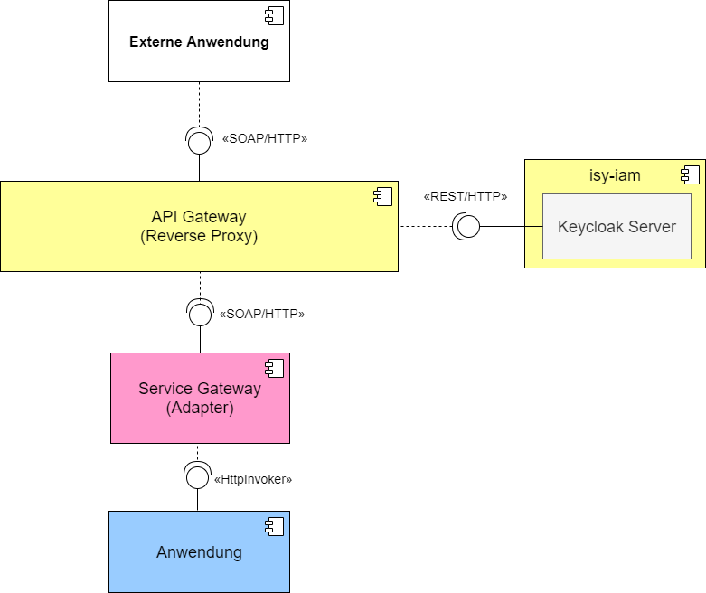
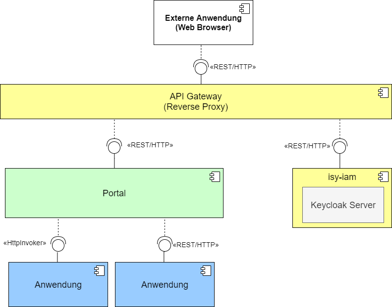
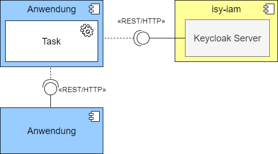

= Konzept Keycloak: Inhalt
include::{isy-dokumentvorlagen}/docs/common/isyfact-attributes.adoc[]

// tag::inhalt[]

== Ziel des Dokuments

Ziele der IsyFact Erweiterung _Sicherheit Keycloak_ und dieses Konzeptes sind:

- Die Bereitstellung von Bausteinen in Form von Adaptern und Filtern, welche die Anbindung von Keycloak an Fachanwendungen oder Anwendungslandschaften reduzieren
- Festlegung eines Sets an Attributen, die über das JWT ausgetauscht werden sollen.

== Grundlagen

Für das Verständnis dieses Dokuments werden Kenntnisse über folgende Themen bzw. Technologien vorausgesetzt.

 - Keycloak
 - OAuth 2.0
 - OpenID Connect (OIDC)
 - Spring Boot Security
 - JSON Web Tokens (JWT)

:desc-table-oauth2-rollen: OAuth 2.0 Rollen innerhalb der Referenzarchitektur
[id="table-oauth2-rollen",reftext="{table-caption} {counter:tables}"]
.{desc-table-oauth2-rollen}
[cols="1,2,1"]
|===
|Rolle|Beschreibung|Beispiel-Komponente

|Resource Owner
|Der Resource Owner gewährt einer Anwendung oder einem Benutzer Zugriff auf eine geschützte Ressource
|-

|Resource Server
|Server, auf welchem die Geschützten Ressourcen liegen.
|Fachanwendung, Register, Querschnittssystem

|Client
|Anwendung, die mit Hilfe des Resource Owner auf eine geschützte Ressource zugreifen möchte.
|Externer Benutzer, SPA

|Authorization Server
|Der Server ist für die Authentifizierung des Resource Owners verantwortlich und stellt Access-Tokens aus.
|Keycloak

|===

== Bausteine

Neben dem Konzept _Sicherheit Keycloak_ enthält die IsyFact Erweiterung noch folgende Bausteine (vgl. <<table-bausteine>>).

:desc-table-bausteine: Bausteine von Keycloak Sicherheit
[id="table-bausteine",reftext="{table-caption} {counter:tables}"]
.{desc-table-bausteine}
[cols="2,3,1"]
|===
|Baustein|Beschreibung|Nutzungsvorgaben

|_isy-sicherheit-keycloak_
|Transformiert das Access-Token, sodass es für die Autorisierung sowohl von _Spring Security_ als auch von _Isy Security_ (über den Aufrufkontext) verwendet werden kann.
Kümmert sich auch um die weitergabe des Access-Tokens über den HTTP-Header.
|<<NutzungsvorgabenSicherheitKeycloak>>

|_isy-iam_
|Enthält einen fertiges Keycloak Server, Beispiel-Konfiguration für Realms und Clients sowie verschiedene Service Provider Interfaces (SPI), welche funktionale Erweiterungen von Keycloak ermöglichen.
|<<NutzungsvorgabenIsyIam>>

|===

== Querschnittliche Konzepte

=== Authentifizierung

Dieser Abschnitt beschreibt die Architektur der Fach- und Querschnittsanwendungen mit Bezug auf die Authentifizierung.
Dabei wird differenziert zwischen  der Authentifizierung am Service Gateway und der Authentifizierung am Portal.

==== Authentifizierung am Service-Gateway

Damit ein Client einer externen Anwendung auf die Ressourcen einer Anwendungslandschaft zugreifen kann, benötigt er ein gültiges Access-Token.
Dieses Token muss sich der Client zuerst beschaffen indem er sich beim Keycloak-Server authentifiziert.
Damit der Client nicht direkt auf den Keycloak-Server zugreifen kann erfolgt die Kommunikation über ein API Gateway welches als Reverse Proxy zwischen den Systemen und Anwendungen und den externen Clients fungiert (vgl. <<image-auth-sgw>>).
Das Service-Gateway behält seine Funktion als Adapter zwischen den verschiedenen Protokollen, kümmert sich aber nicht mehr um die Authentifizierung der Clients.
Für Anwendungen mit HttpInvoker-Schnittstellen wird ein `Aufrufkontext` statt eines Access-Tokens erwartet.
Der Baustein _isy-sicherheit-keycloak_ kümmert sich um die Umwandlung von Access-Tokens in `Aufrufkontext` Objekte.

:desc-image-auth-sgw: Authentifizierung am Service-Gateway
[id="image-auth-sgw",reftext="{figure-caption} {counter:figures}"]
.{desc-image-auth-sgw}

:desc-table-komponenten-ath-sgw: Beteiligte Teilsysteme bei der Authentifizierung über ein SGW.
[id="table-komponenten-ath-sgw",reftext="{table-caption} {counter:tables}"]
.{desc-table-komponenten-ath-sgw}
[cols="1,2"]
|===
|Teilsystem|Funktionalität

|Externe Anwendung
|Beliebiges externes System oder Anwendung, die Daten aus einer Anwendungslandschaft beziehen möchte.
Das externe System sendet seine Credentials mit dem Request.

|API Gateway (Reverse Proxy)
|Kapselt den Zugriff auf die API, insbesondere den Zugriff auf die API des Keycloak Servers.

|Service Gateway (Adapter)
|Wandelt SOAP/HTTP Anfragen in Formate, die von internen Anwendungen verstanden werden (z.B. HttpInvoker oder REST).

|Keycloak Server (isy-iam)
|Authorization Server und OpenID Provider.

|Anwendung
|Beliebige interne .

|===

//ür Behörden oder Institute, die zunächst auf Keycloak umstellen wollen und anschließend die Authentifizierung für die Externen Clients umstellen möchten, gibt es eine Zwischenlösung, bei welcher vorerst das Service-Gateway die Authentifizierung der Clients weiterhin übernimmt (vgl. <<image-auth-sgw-legacy>>).
//
//:desc-image-auth-sgw-legacy: Authentifizierung am Service-Gateway während der Migration
//[id="image-auth-sgw-legacy",reftext="{figure-caption} {counter:figures}"]
//.{desc-image-auth-sgw-legacy}
//image::images/konzept_keycloak_auth_sgw_legacy.png[align="center"]
//
//Das Service Gateway verwendet den _Passwort Grant Type_ und besorgt sich mit Hilfe der Credentials des Clients ein gültiges Access-Token vom Keycloak-Server.
//Mit Hilfe des Access-Tokens kann das SGW entweder direkt auf die Ressourcen der Anwendungen zugreifen oder es erzeugt daraus ein `AufrufKontext` Objekt, welches von _HttpInvoker_ Schnittstellen erwartet wird.
//Der Baustein _isy-keycloak-sicherheit_ liefert eine Implementierung des `AccessManager` aus _isy-sicherheit_, welcher sich um die Authentifizierung und die Erzeugung des `Aufrufkontext` kümmert.

:desc-table-granttypes-auth-sgw: Grant Types am SGW
[id="table--granttypes-auth-sgw",reftext="{table-caption} {counter:tables}"]
.{desc-table-granttypes-auth-sgw}
[cols="1,3"]
|===
|Grant Type|Beispiel Szenario

|Authorization Code
|Die Anwendungslandschaft stellt eine Schnittstelle bereit, weiß jedoch nicht wer sie später verwenden möchte.
Der Client ist beispielsweise eine SPA oder ein nativer Client in einer anderen Behörde

//|Resource Owner Password Credentials
//|Die Anwendungslandschaft hat den Client selber entwickelt oder vertraut der Gegenseite (möglicherweise eine anderen Behörde) die Verwendung von Anmeldeinformationen an.

|===

==== Authentifizierung am Portal

Ähnlich wie bei der Authentifizierung über das SGW, wird hier die Kommunikation zuerst über ein API-Gateway (Reverse Proxy) geführt.
Die Externe Anwendung (i.d.R. eine grafische Benutzeroberfläche) besorgt sich in gültiges Access-Token beim Keycloak Server und kann anschließend auf die Ressourcen der einzelnen Fachanwendungen zugreifen
Im Portal übernimmt _isy-sicherheit-keycloak_ die Aufgabe, das Access-Token ggf. in einen `Aufrufkontext` zu wandeln.

:desc-image-auth-portal: Authentifizierung am Portal bzw. API-Gateway
[id="image-auth-portal",reftext="{figure-caption} {counter:figures}"]
.{desc-image-auth-portal}

:desc-table-granttypes-auth-portal: Grant Types am Portal
[id="table--granttypes-auth-portal",reftext="{table-caption} {counter:tables}"]
.{desc-table-granttypes-auth-portal}
[cols="1,3"]
|===
|Grant Type|Beispiel Szenario

|Authorization Code
|Das Portal liefert eine GUI (z.B. SPA) an den User Agend (Browser) eines Benutzers aus.
Hierbei muss sichergestellt werden, dass die Anfragen auch wirklich von dem Client stammten, der im User-Agend des berechtigten Benutzers ausgeführt wird.

|===

==== Authentifizierung von Tasks und Batches

Tasks oder Batches, die auf Schnittstellen anderer Anwendungen zugreifen, müssen sich ebenfalls authentifizieren um ein Access-Token zu erhalten.
Tasks werden innerhalb von Anwendungen bzw. Anwendungslandschaften gestartet und dürfen direkt auf den Keycloak Server zugreifen (vgl. <<image-auth-task>>).

:desc-image-auth-task: Authentifizierung von Tasks
[id="image-auth-task",reftext="{figure-caption} {counter:figures}"]
.{desc-image-auth-task}

:desc-table-granttypes-auth-portal: Grant Types für Tasks und Batches
[id="table--granttypes-auth-portal",reftext="{table-caption} {counter:tables}"]
.{desc-table-granttypes-auth-portal}
[cols="1,3"]
|===
|Grant Type|Beispiel Szenario

|Client Credential
|Zeitgesteuerte Tasks oder Batches müssen ggf. auf andere Anwendungen innerhalb einer Anwendungslandschaft zugreifen und brauchen dafür ein Access-Token.

|===

=== Autorisierung

Für die Autorisierung von Benutzern bietet die Standard Bibliothek _isy-sicherheit_ zurzeit zwei Möglichkeiten.

:desc-table-autorisierung: Möglichkeiten der Autorisierung über isy-sicherheit
[id="table-autorisierung",reftext="{table-caption} {counter:tables}"]
.{desc-table-autorisierung}
[cols="2,3,2"]
|===
|Option|Beschreibung|Details

|Spring Security
|Der Baustein _isy-sicherheit_ liefert Spring Security.
Somit können die Standard-Konzepte von Spring direkt verwendet werden.
|

|Isy Sicherheit
|Bietet eine Konfiguration für ein Rollen & Rechte Mapping an, sowie verschiedene Features zur Absicherung von IsyFact Bausteinen, die HttpInvoker-Schnittstellen verwenden.
|<<NutzungsvorgabenIsySicherheit>>

|===

IMPORTANT: Für die Autorisierung von REST-Schnittstellen sollten ausschließlich die Standard Mechanismen von Spring Security verwendet werden, da _isy-sicherheit_ perspektivisch den `Aufrufkontext` durch _Spring Security_ ablösen wird.

=== Access Token

Beim Authentifizierungsprotokoll OpenID Connect gibt es _Idendity Tokens_ und _Access Tokens_.
Für beide Arten wird bei Keycloak der _JSON Web Token (JWT)_ Standard verwendet.
In diesem Kapitel werden zum einen die Daten beschrieben, die in einem JWT enthalten sein müssen und wie mit dem Token innerhalb von Anwendungen umgegangen werden soll.

==== Daten in JWT (Claims)

Ein JWT besteht aus drei Bereichen: Header, Payload und einer Signatur, mit der die Authentizität des Tokens verifiziert werden kann.
Die Attribute innerhalb eines Tokens werden auch Claim genannt, <<table-claim-aufrufkontext>> beschreibt das Minimum an Claims, die ein JWT enthalten muss, damit es in einen Aufrufkontext gewandelt werden kann.

:desc-table-claim-aufrufkontext: Zuordnung Claims zu Attribute des Aufrufkontext
[id="table-claim-aufrufkontext",reftext="{table-caption} {counter:tables}"]
.{desc-table-claim-aufrufkontext}
[cols="1,1"]
|===
|Aufrufkontext|JWT

|`durchfuehrenderBenutzerKennung`
|`preferred_username`

|`durchfuehrenderBenutzerPasswort`
|_N/A_

|`durchfuehrendeBehoerde`
|`bhknz`

|`korrelationsId`
|_N/A_

|`rolle`
|`resource_access.account.roles`

|`rollenErmittelt`
|_N/A_

|`durchfuehrenderSachbearbeiterName`
|`family_name`

|`durchfuehrenderBenutzerInterneKennung`
|`internekennung`

|===

Einige Felder des `Aufrufkontext` können nicht mehr aus dem JWT befüllt werden.

* `durchfuehrenderBenutzerPasswort` - Das Passwort wird aus Sicherheitsgründen nicht mehr in die Anwendungen übertragen.

* `korrelationsId` - Die Korrelations-ID ist nicht Teil des Authentifizierungs- bzw. de Autorisierungsprozesses und wird stattdessen über den HTTP-Header oder den MDC übertragen.

* `rollenErmittelt` - Wird ein Aufrufkontext aus einem JWT Token erzeugt, kann immer davon ausgegangen erden, dass die Rollen ermittelt sind, da diese direkt im JWT stehen.

Daten, die durch die Erweiterung des `Aufrufkontext` zwischen HttpInvoker-Schnittstellen ausgetauscht werden, sollen nicht über JWT transportiert werden.
<<table-vorgabe-datenuebertragung>> zeigt, welche Übertragungswege für welche Art von Daten standardmäßig vorgesehen sind.

:desc-table-vorgabe-datenuebertragung: Zuordnung Daten zu Übertragungsarten
[id="table-vorgabe-datenuebertragung",reftext="{table-caption} {counter:tables}"]
.{desc-table-vorgabe-datenuebertragung}
[cols="1,1,1"]
|===
|Kontext|Übertragungsart|Beispiel

|Autorisierung (Rollen & Scope)
|Access-Token (JWT)
|Rollen

|Benutzer Informationen
|User-Info-Endpoint Keycloak (REST)
|Name, E-Mail

|Technische Metadaten
|HTTP-Header
|Korrelations-ID

|Fachliche Daten
|HTTP-Body
|Aktenzeichen

|===

[[access-access-tokens]]
==== Zugriff auf Access Tokens

Ein direkter Zugriff auf das Access-Token in einer Anwendung ist nicht notwendig, stattdessen werden die notwendigen Claims des Tokens mit Hilfe eines Filters in ein `Authorization` Objekt gewandelt.
Das `Authorization` Objekt liegt im `SecurityContext` von Spring und dieser wird von einem `SecurityContextHolder` verwaltet.
Der `SecurityContextHolder` kann per DI oder besser noch mit Hilfe von AOP für die Absicherung von Schnittstellen verwendet werden.

Der Zugriff auf Benutzerdaten zu einem angemeldeten Benutzer erfolgt über den _user-info-endpoint_ von Keycloak.
Dieser Zugriff wird typischerweise in einem `UserDetailService` gekapselt.

==== Unterstützung von nebenläufigen Zugriffen

Im Abschnitt <<access-access-tokens>> wurde beschrieben, dass der Zugriff auf die Informationen im Access-Token über den `SecurityContext` von Spring Boot gekapselt werden soll.
Der `SecurityContext` steht standardmäßig nur in dem Thread zur Verfügung, der dem aktiven Request zugeteilt wurde.
Für Multi-Threaded Umgebungen stellt Spring Boot die Wrapper-Klassen `DelegatingSecurityContextRunnable` und `DelegatingSecurityContextExecutor` zur Verfügung.
Werden nebenläufige Prozesse über eine dieser Wrapper-Klassen gestartet, haben Entwickler innerhalb der Prozesse Zugriff auf den `SecurityContext` (Details sind link:https://docs.spring.io/spring-security/site/docs/5.0.x/reference/html/concurrency.html[hier] zu finden).

//==== Versionierung
//
//Der Payload des JWT ist davon abhängig, welche Mapper in den Clients bzw. Client-Scopes verwendet werden.
//Eine Versionierung ist somit sehr komplex und wird von Keycloak auch nicht unterstützt.

=== Keycloak Erweiterungen

Der Baustein `isy-iam` bietet verschiedene Service Provider Interfaces (SPI) für Keycloak an.
In diesem Abschnitt wird erläutert, welche querschnittlichen Anforderungen damit leichter umgesetzt werden können.

:desc-table-uebersicht-spi: Übersicht der SPI und ihrer querschnittlichen Anforderungen
[id="table-uebersicht-sp",reftext="{table-caption} {counter:tables}"]
.{desc-table-uebersicht-sp}
[cols="1,1"]
|===
|SPI|Erfüllt Anforderung(en)

|bnvz-user-storage
|Migration der IsyFact Erweiterung _Benutzerverzeichnis_

|registerfactory-event-listener
|Logging, Protokollierung

|registerfactory-brute-force-detector
|Verfügbarkeit

|keycloak-single-session
|Security, Lizenzmodell

|isyfact-theme
|Attraktivität

|===

Folgende Anforderungen bzw. Szenarien können mit den unterschiedlichen SPIs umgesetzt werden.

*bnvz-user-storage*::
- Integration eines vorhandenen Benutzerverzeichnis in Keycloak

WARNING: Das Benutzerverzeichnis ist in allen Realms verfügbar, falls vollständig disjunkte Realms benötigt werden, ist diese Erweiterung nicht geeignet.

*registerfactory-event-listener*::
- Protokollierung sicherheitsrelevanter Events (OPS 1.1.5)

*registerfactory-brute-force-detector*::
- Abwehr von Brute-Force Attacken

*keycloak-single-session*::
- Bessere Session-Kontrolle (z.B: bei Schutzbedarf hoch oder sehr hoch)
- User mit einer Lizenz sollen sich nur einmal einloggen dürfen

IMPORTANT: Bei manchen Anwendungen erwarten Benutzer, dass sie sich mehrfach Anmelden können.
Beispielsweise, wenn die Anwendung über mehrere Endgeräte gleichzeitig bedient werden kann.

*isyfact-theme*::
- Anpassung der Login Seite an das Corporate Design

// end::inhalt[]